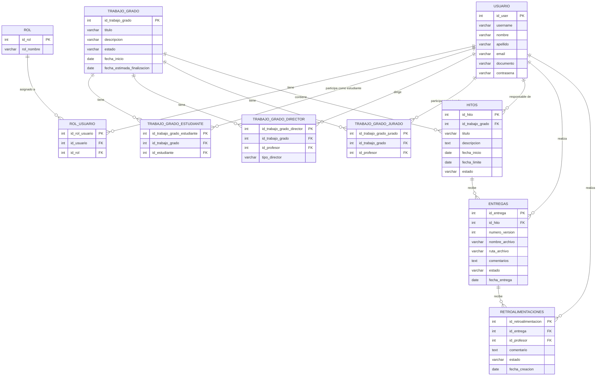

## Backend del sistema de seguimiento de los trabajos de grados de la Universidad

### Problema a resolver
- Actualmente, la gestión de tesis y trabajos de grado suele dispersarse entre diversos canales de comunicación, como correos electrónicos y reuniones informales. Esta falta de centralización dificulta mantener un registro formal y estructurado del seguimiento y los avances realizados entre estudiantes y directores

### Solución:
- la solución que se ha diseñado para esto, es desarrollar una plataforma virtual en la cual se le hará el seguimiento correcto; marcado por hitos definidos, enregas de avances, retroalimentaciones por parte del director y seguimiento del cronograma de graduación


### Diagrama Entidad-Relación — Seguimiento de Trabajos de Grado



### Arquitectura del proyecto
- por indicaciones se ha decidido utilizar una arquitectura por capas o arquitectura modular por responsabilidades, en donde cada directorio posee una responsabilidad. permitiendo separar la lógica de la aplicación, fecilitar el mantenimiento y evittar que el codigo esté concentrado en un mismo lugar y hacerlo demasiado denso.

```text
app/
├── api/           # Endpoints y rutas de la API
├── core/          # Configuración y componentes centrales
├── models/        # Modelos y esquemas de datos
├── repositories/  # Acceso y operaciones con la base de datos
└── main.py        # Punto de entrada de la aplicación

```

#### Autores
- Owen Sanchez
- Jair Joven
- Jenifer Camacho

#### Corporación universitaria Latinoamericana - CUL