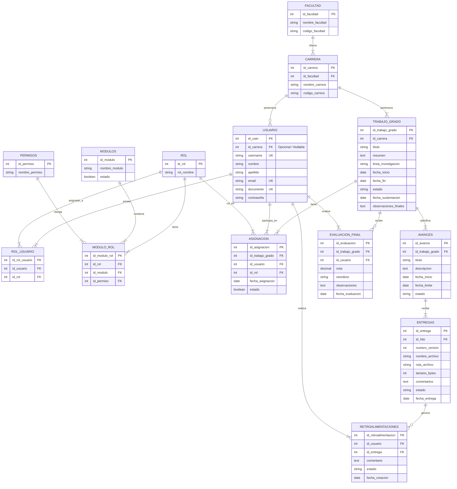

# Backend del sistema de seguimiento de trabajos de grado

API REST construida con **FastAPI** para centralizar el seguimiento de trabajos de grado de la universidad. El sistema permite registrar usuarios, roles, trabajos de grado, asignaciones de estudiantes, directores y jurados, ademas de hitos, entregas y retroalimentaciones.

## Problema a resolver

La gestion de tesis y trabajos de grado suele dispersarse entre correos, reuniones informales y documentos aislados. Esta falta de centralizacion dificulta mantener un registro formal, consultar avances, revisar entregas y hacer seguimiento al cronograma de graduacion.

## Solucion propuesta

La plataforma backend organiza el proceso academico mediante:

- Registro de usuarios y roles.
- Creacion y seguimiento de trabajos de grado.
- Asignacion de estudiantes, directores y jurados.
- Definicion de hitos del proyecto.
- Registro de entregas por version.
- Retroalimentacion de profesores sobre las entregas.

## Tecnologias principales

| Tecnologia | Uso |
| --- | --- |
| Python | Lenguaje principal del backend |
| FastAPI | Framework para construir la API REST |
| Uvicorn | Servidor ASGI para ejecutar la aplicacion |
| Pydantic | Validacion y definicion de modelos de datos |
| PostgreSQL | Base de datos relacional |
| psycopg2 | Conexion entre Python y PostgreSQL |
| python-dotenv | Carga de variables de entorno desde `.env` |

## Arquitectura del proyecto

El proyecto usa una arquitectura modular por responsabilidades. Cada carpeta separa una parte de la aplicacion para facilitar mantenimiento, lectura y escalabilidad.

```text
app/
├── api/           # Endpoints y rutas de la API
├── core/          # Configuracion central, conexion a base de datos
├── models/        # Modelos Pydantic para entrada y salida de datos
├── repositories/  # Consultas SQL y operaciones con la base de datos
└── main.py        # Punto de entrada de la aplicacion FastAPI

DB/
├── consulta tablas DB.sql
├── diccionario_datos2.md
└── diseño db.pdf
```

## Configuracion

Crear un archivo `.env` en la raiz del proyecto tomando como base `.env-ejemplo.txt`:

```env
DB_HOST=TU_HOST_DE_LA_DATABASE
DB_NAME=NOMBRE_DE_LA_DATABASE
DB_USER=USUARIO_DE_LA_DATABASE
DB_PASSWORD=CONTRASENA_DATABASE
DB_PORT=TU_PUERTO_DE_LA_DATABASE
```

## Instalacion y ejecucion

```bash
python -m venv myenv
myenv\Scripts\activate
pip install -r requirements.txt
uvicorn app.main:app --reload
```

Al iniciar el servidor, la API queda disponible normalmente en:

- API: `http://127.0.0.1:8000/docs`


## Entidades, modelos, repositorios y endpoints

### Usuario

| Elemento | Detalle |
| --- | --- |
| Entidad / tabla | `usuario` |
| Ruta API | `app/api/rutas_usuario.py` |
| Modelo | `app/models/usuario.py` |
| Repositorio | `app/repositories/usuario_repo.py` |
| Clase repositorio | `UsuarioRepository` |
| Modelos Pydantic | `Usuario`, `UsuarioCrear`, `UsuarioRespuesta`, `ActualizarUsuario` |
| Campos principales | `id_user`, `username`, `nombre`, `apellido`, `email`, `documento`, `contrasena` |

| Metodo | Endpoint | Accion |
| --- | --- | --- |
| GET | `/usuarios/` | Listar usuarios |
| GET | `/usuarios/{id_user}` | Consultar usuario por ID |
| POST | `/usuarios/` | Crear usuario |
| PUT | `/usuarios/{id_user}` | Actualizar usuario |
| DELETE | `/usuarios/{id_user}` | Eliminar usuario |

### Rol

| Elemento | Detalle |
| --- | --- |
| Entidad / tabla | `rol` |
| Ruta API | `app/api/rutas_rol.py` |
| Modelo | `app/models/rol.py` |
| Repositorio | `app/repositories/rol_repo.py` |
| Clase repositorio | `RolRepository` |
| Modelos Pydantic | `Rol`, `CrearRol`, `ActualizarRol` |
| Campos principales | `id_rol`, `rol_nombre` |

| Metodo | Endpoint | Accion |
| --- | --- | --- |
| GET | `/rol/` | Listar roles |
| GET | `/rol/{id_rol}` | Consultar rol por ID |
| POST | `/rol/` | Crear rol |
| PUT | `/rol/{id_rol}` | Actualizar rol |
| DELETE | `/rol/{id_rol}` | Eliminar rol |

### Rol usuario

| Elemento | Detalle |
| --- | --- |
| Entidad / tabla | `rol_usuario` |
| Ruta API | `app/api/rutas_rol_usuario.py` |
| Modelo | `app/models/rol_usuario.py` |
| Repositorio | `app/repositories/rol_usuario_repo.py` |
| Clase repositorio | `RolUsuarioRepository` |
| Modelos Pydantic | `RolUsuario`, `CrearRelacionUsuarioRol`, `RolUsuarioRespuesta`, `ActualizarRelacionRolYUsuario` |
| Campos principales | `id_rol_usuario`, `id_usuario`, `id_rol` |

| Metodo | Endpoint | Accion |
| --- | --- | --- |
| GET | `/rol_usuario/` | Listar relaciones usuario-rol |
| GET | `/rol_usuario/{id_rol_usuario}` | Consultar relacion por ID |
| POST | `/rol_usuario/` | Crear relacion usuario-rol |
| PUT | `/rol_usuario/{id_rol_usuario}` | Actualizar rol asignado |
| DELETE | `/rol_usuario/{id_rol_usuario}` | Eliminar relacion usuario-rol |

### Trabajo de grado

| Elemento | Detalle |
| --- | --- |
| Entidad / tabla | `trabajo_grado` |
| Ruta API | `app/api/rutas_trabajo_grado.py` |
| Modelo | `app/models/trabajo_grado.py` |
| Repositorio | `app/repositories/trabajo_grado_repo.py` |
| Clase repositorio | `TrabajoGradoRepository` |
| Modelos Pydantic | `Trabajo_grado`, `CrearTrabajoGrado`, `ActualizarTrabajoGrado` |
| Campos principales | `id_trabajo_grado`, `titulo`, `descripcion`, `estado`, `fecha_inicio`, `fecha_estimada_finalizacion` |

| Metodo | Endpoint | Accion |
| --- | --- | --- |
| GET | `/trabajo_grado/` | Listar trabajos de grado |
| GET | `/trabajo_grado/{id_trabajo_grado}` | Consultar trabajo de grado por ID |
| POST | `/trabajo_grado/` | Crear trabajo de grado |
| PUT | `/trabajo_grado/{id_trabajo_grado}` | Actualizar trabajo de grado |
| DELETE | `/trabajo_grado/{id_trabajo_grado}` | Eliminar trabajo de grado |


### Facultad

| Elemento | Detalle |
| --- | --- |
| Entidad / tabla | `facultad` |
| Ruta API | `app/api/rutas_facultad.py` |
| Modelo | `app/models/facultad.py` |
| Repositorio | `app/repositories/facultad_repo.py` |
| Clase repositorio | `FacultadRepository` |
| Campos principales | `id_facultad`, `nombre_facultad`, `codigo_facultad` |

| Método | Endpoint | Acción |
| --- | --- | --- |
| GET | `/facultad/` | Listar facultades |
| GET | `/facultad/{id_facultad}` | Consultar facultad por ID |
| POST | `/facultad/` | Crear facultad |
| PUT | `/facultad/{id_facultad}` | Actualizar facultad |
| DELETE | `/facultad/{id_facultad}` | Eliminar facultad |


### Carrera

| Elemento | Detalle |
| --- | --- |
| Entidad / tabla | `carrera` |
| Ruta API | `app/api/rutas_carrera.py` |
| Modelo | `app/models/carrera.py` |
| Repositorio | `app/repositories/carrera_repo.py` |
| Clase repositorio | `CarreraRepository` |
| Campos principales | `id_carrera`, `id_facultad`, `nombre_carrera`, `codigo_carrera` |

| Método | Endpoint | Acción |
| --- | --- | --- |
| GET | `/carrera/` | Listar carreras |
| GET | `/carrera/{id_carrera}` | Consultar carrera por ID |
| POST | `/carrera/` | Crear carrera |
| PUT | `/carrera/{id_carrera}` | Actualizar carrera |
| DELETE | `/carrera/{id_carrera}` | Eliminar carrera |


### Asignación

| Elemento | Detalle |
| --- | --- |
| Entidad / tabla | `asignacion` |
| Ruta API | `app/api/rutas_asignacion.py` |
| Modelo | `app/models/asignacion.py` |
| Repositorio | `app/repositories/asignacion_repo.py` |
| Clase repositorio | `AsignacionRepository` |
| Campos principales | `id_asignacion`, `id_trabajo_grado`, `id_usuario`, `id_rol`, `fecha_asignacion`, `estado` |

| Método | Endpoint | Acción |
| --- | --- | --- |
| GET | `/asignacion/` | Listar asignaciones |
| GET | `/asignacion/{id_asignacion}` | Consultar asignación por ID |
| POST | `/asignacion/` | Crear asignación |
| PUT | `/asignacion/{id_asignacion}` | Actualizar asignación |
| DELETE | `/asignacion/{id_asignacion}` | Eliminar asignación |


### Avances

| Elemento | Detalle |
| --- | --- |
| Entidad / tabla | `avances` |
| Ruta API | `app/api/rutas_avances.py` |
| Modelo | `app/models/avances.py` |
| Repositorio | `app/repositories/avances_repo.py` |
| Clase repositorio | `AvancesRepository` |
| Campos principales | `id_avance`, `id_trabajo_grado`, `titulo`, `descripcion`, `fecha_inicio`, `fecha_limite`, `estado` |

| Método | Endpoint | Acción |
| --- | --- | --- |
| GET | `/avances/` | Listar avances |
| GET | `/avances/{id_avance}` | Consultar avance por ID |
| POST | `/avances/` | Crear avance |
| PUT | `/avances/{id_avance}` | Actualizar avance |
| DELETE | `/avances/{id_avance}` | Eliminar avance |


## Diagrama entidad-relacion




## Flujo general del sistema
Flujo general del sistema

1. Se registra una facultad en `/facultad/` y sus carreras asociadas en  `/carrera/ `.

2. Se registra un usuario en  `/usuario/ `.

3. Se crea un rol en  `/rol/ `.

4. Se asigna el rol al usuario en  `/rol_usuario/ `.

5. Se definen módulos en  `/modulos/ `, permisos en  `/permisos/ ` y se vinculan en  `/modulo_rol/ `.

6. Se registra un trabajo de grado en  `/trabajo_grado/ `.

7. Se asignan estudiantes, tutores y jurados al trabajo de grado en  `/asignacion/ `.

8. Se crean avances (avances) asociados al trabajo de grado en  `/avances/ `.

9. Los estudiantes registran entregas para cada hito en  `/entregas/ `.

10. Los docentes/tutores registran retroalimentaciones sobre las entregas en  `/retroalimentaciones/ `.

11. Los jurados registran la nota final y veredicto en  `/evaluacion_final/ `.

## Autores

- Owen Sanchez
- Jair Joven
- Jenifer Camacho

## Institucion

Corporacion Universitaria Latinoamericana - CUL
