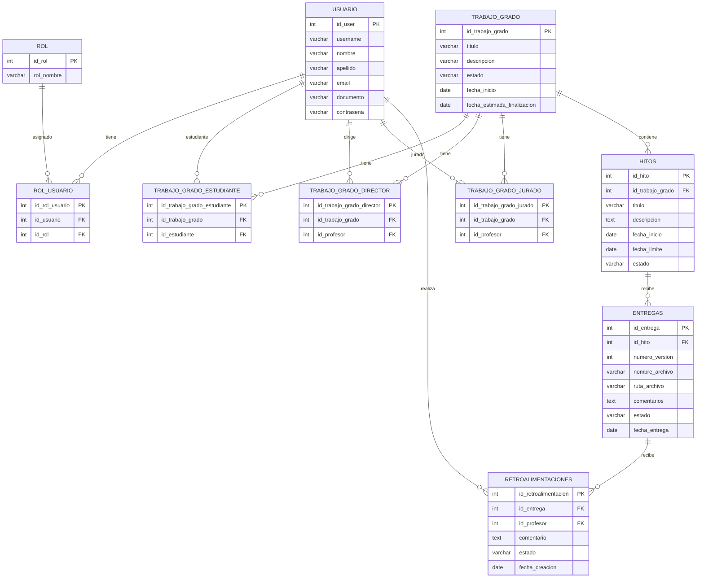

# Backend del sistema de seguimiento de trabajos de grado

API REST construida con **FastAPI** para centralizar el seguimiento de trabajos de grado de la universidad. El sistema permite registrar usuarios, roles, trabajos de grado, asignaciones de estudiantes, directores y jurados, ademas de hitos, entregas y retroalimentaciones.

## Problema a resolver

La gestion de tesis y trabajos de grado suele dispersarse entre correos, reuniones informales y documentos aislados. Esta falta de centralizacion dificulta mantener un registro formal, consultar avances, revisar entregas y hacer seguimiento al cronograma de graduacion.

## Solucion propuesta

La plataforma backend organiza el proceso academico mediante:

- Registro de usuarios y roles.
- Creacion y seguimiento de trabajos de grado.
- Asignacion de estudiantes, directores y jurados.
- Definicion de hitos del proyecto.
- Registro de entregas por version.
- Retroalimentacion de profesores sobre las entregas.

## Tecnologias principales

| Tecnologia | Uso |
| --- | --- |
| Python | Lenguaje principal del backend |
| FastAPI | Framework para construir la API REST |
| Uvicorn | Servidor ASGI para ejecutar la aplicacion |
| Pydantic | Validacion y definicion de modelos de datos |
| PostgreSQL | Base de datos relacional |
| psycopg2 | Conexion entre Python y PostgreSQL |
| python-dotenv | Carga de variables de entorno desde `.env` |

## Arquitectura del proyecto

El proyecto usa una arquitectura modular por responsabilidades. Cada carpeta separa una parte de la aplicacion para facilitar mantenimiento, lectura y escalabilidad.

```text
app/
├── api/           # Endpoints y rutas de la API
├── core/          # Configuracion central, conexion a base de datos
├── models/        # Modelos Pydantic para entrada y salida de datos
├── repositories/  # Consultas SQL y operaciones con la base de datos
└── main.py        # Punto de entrada de la aplicacion FastAPI

DB/
├── consulta tablas DB.sql
├── diccionario_datos2.md
└── diseño db.pdf
```

## Configuracion

Crear un archivo `.env` en la raiz del proyecto tomando como base `.env-ejemplo.txt`:

```env
DB_HOST=TU_HOST_DE_LA_DATABASE
DB_NAME=NOMBRE_DE_LA_DATABASE
DB_USER=USUARIO_DE_LA_DATABASE
DB_PASSWORD=CONTRASENA_DATABASE
DB_PORT=TU_PUERTO_DE_LA_DATABASE
```

## Instalacion y ejecucion

```bash
python -m venv myenv
myenv\Scripts\activate
pip install -r requirements.txt
uvicorn app.main:app --reload
```

Al iniciar el servidor, la API queda disponible normalmente en:

- API: `http://127.0.0.1:8000/docs`


## Entidades, modelos, repositorios y endpoints

### Usuario

| Elemento | Detalle |
| --- | --- |
| Entidad / tabla | `usuario` |
| Ruta API | `app/api/rutas_usuario.py` |
| Modelo | `app/models/usuario.py` |
| Repositorio | `app/repositories/usuario_repo.py` |
| Clase repositorio | `UsuarioRepository` |
| Modelos Pydantic | `Usuario`, `UsuarioCrear`, `UsuarioRespuesta`, `ActualizarUsuario` |
| Campos principales | `id_user`, `username`, `nombre`, `apellido`, `email`, `documento`, `contrasena` |

| Metodo | Endpoint | Accion |
| --- | --- | --- |
| GET | `/usuarios/` | Listar usuarios |
| GET | `/usuarios/{id_user}` | Consultar usuario por ID |
| POST | `/usuarios/` | Crear usuario |
| PUT | `/usuarios/{id_user}` | Actualizar usuario |
| DELETE | `/usuarios/{id_user}` | Eliminar usuario |

### Rol

| Elemento | Detalle |
| --- | --- |
| Entidad / tabla | `rol` |
| Ruta API | `app/api/rutas_rol.py` |
| Modelo | `app/models/rol.py` |
| Repositorio | `app/repositories/rol_repo.py` |
| Clase repositorio | `RolRepository` |
| Modelos Pydantic | `Rol`, `CrearRol`, `ActualizarRol` |
| Campos principales | `id_rol`, `rol_nombre` |

| Metodo | Endpoint | Accion |
| --- | --- | --- |
| GET | `/rol/` | Listar roles |
| GET | `/rol/{id_rol}` | Consultar rol por ID |
| POST | `/rol/` | Crear rol |
| PUT | `/rol/{id_rol}` | Actualizar rol |
| DELETE | `/rol/{id_rol}` | Eliminar rol |

### Rol usuario

| Elemento | Detalle |
| --- | --- |
| Entidad / tabla | `rol_usuario` |
| Ruta API | `app/api/rutas_rol_usuario.py` |
| Modelo | `app/models/rol_usuario.py` |
| Repositorio | `app/repositories/rol_usuario_repo.py` |
| Clase repositorio | `RolUsuarioRepository` |
| Modelos Pydantic | `RolUsuario`, `CrearRelacionUsuarioRol`, `RolUsuarioRespuesta`, `ActualizarRelacionRolYUsuario` |
| Campos principales | `id_rol_usuario`, `id_usuario`, `id_rol` |

| Metodo | Endpoint | Accion |
| --- | --- | --- |
| GET | `/rol_usuario/` | Listar relaciones usuario-rol |
| GET | `/rol_usuario/{id_rol_usuario}` | Consultar relacion por ID |
| POST | `/rol_usuario/` | Crear relacion usuario-rol |
| PUT | `/rol_usuario/{id_rol_usuario}` | Actualizar rol asignado |
| DELETE | `/rol_usuario/{id_rol_usuario}` | Eliminar relacion usuario-rol |

### Trabajo de grado

| Elemento | Detalle |
| --- | --- |
| Entidad / tabla | `trabajo_grado` |
| Ruta API | `app/api/rutas_trabajo_grado.py` |
| Modelo | `app/models/trabajo_grado.py` |
| Repositorio | `app/repositories/trabajo_grado_repo.py` |
| Clase repositorio | `TrabajoGradoRepository` |
| Modelos Pydantic | `Trabajo_grado`, `CrearTrabajoGrado`, `ActualizarTrabajoGrado` |
| Campos principales | `id_trabajo_grado`, `titulo`, `descripcion`, `estado`, `fecha_inicio`, `fecha_estimada_finalizacion` |

| Metodo | Endpoint | Accion |
| --- | --- | --- |
| GET | `/trabajo_grado/` | Listar trabajos de grado |
| GET | `/trabajo_grado/{id_trabajo_grado}` | Consultar trabajo de grado por ID |
| POST | `/trabajo_grado/` | Crear trabajo de grado |
| PUT | `/trabajo_grado/{id_trabajo_grado}` | Actualizar trabajo de grado |
| DELETE | `/trabajo_grado/{id_trabajo_grado}` | Eliminar trabajo de grado |

### Trabajo de grado estudiante

| Elemento | Detalle |
| --- | --- |
| Entidad / tabla | `trabajo_grado_estudiante` |
| Ruta API | `app/api/rutas_trabajo_grado_estudiantes.py` |
| Modelo | `app/models/trabajo_grado_estudiante.py` |
| Repositorio | `app/repositories/trabajo_grado_estudiante_repo.py` |
| Clase repositorio | `TrabajoGradoEstudianteRepository` |
| Modelos Pydantic | `Trabajo_grado_estudiante`, `CrearTrabajoGradoPorEstudiante`, `ActualizarTrabajoGradoPorEstudiante` |
| Campos principales | `id_trabajo_grado_estudiante`, `id_trabajo_grado`, `id_estudiante` |

| Metodo | Endpoint | Accion |
| --- | --- | --- |
| GET | `/trabajo_grado_estudiantes/` | Listar asignaciones de trabajos a estudiantes |
| GET | `/trabajo_grado_estudiantes/{id_trabajo_grado_estudiante}` | Consultar asignacion por ID |
| POST | `/trabajo_grado_estudiantes/` | Asignar trabajo de grado a estudiante |
| PUT | `/trabajo_grado_estudiantes/{id_trabajo_grado_estudiante}` | Actualizar asignacion |
| DELETE | `/trabajo_grado_estudiantes/{id_trabajo_grado_estudiante}` | Eliminar asignacion |

### Trabajo de grado director

| Elemento | Detalle |
| --- | --- |
| Entidad / tabla | `trabajo_grado_director` |
| Ruta API | `app/api/rutas_trabajo_grado_director.py` |
| Modelo | `app/models/trabajo_grado_director.py` |
| Repositorio | `app/repositories/trabajo_grado_director_repo.py` |
| Clase repositorio | `TrabajoGradoDirectorRepository` |
| Modelos Pydantic | `Trabajo_grado_director`, `Crear_trabajo_grado_director`, `Actualizar_trabajo_grado_director` |
| Campos principales | `id_trabajo_grado_director`, `id_trabajo_grado`, `id_profesor` |

| Metodo | Endpoint | Accion |
| --- | --- | --- |
| GET | `/trabajo_grado_director/` | Listar asignaciones de trabajos a directores |
| GET | `/trabajo_grado_director/{id_trabajo_grado_director}` | Consultar asignacion por ID |
| POST | `/trabajo_grado_director/` | Asignar director a trabajo de grado |
| PUT | `/trabajo_grado_director/{id_trabajo_grado_director}` | Actualizar asignacion |
| DELETE | `/trabajo_grado_director/{id_trabajo_grado_director}` | Eliminar asignacion |

### Trabajo de grado jurado

| Elemento | Detalle |
| --- | --- |
| Entidad / tabla | `trabajo_grado_jurado` |
| Ruta API | `app/api/rutas_trabajo_grado_jurado.py` |
| Modelo | `app/models/trabajo_grado_jurado.py` |
| Repositorio | `app/repositories/trabajo_grado_jurado_repo.py` |
| Clase repositorio | `TrabajoGradoJuradoRepository` |
| Modelos Pydantic | `Trabajo_grado_jurado`, `Crear_trabajo_grado_jurado`, `Actualizar_trabajo_grado_jurado` |
| Campos principales | `id_trabajo_grado_jurado`, `id_trabajo_grado`, `id_profesor` |

| Metodo | Endpoint | Accion |
| --- | --- | --- |
| GET | `/trabajo_grado_jurado/` | Listar asignaciones de trabajos a jurados |
| GET | `/trabajo_grado_jurado/{id_trabajo_grado_jurado}` | Consultar asignacion por ID |
| POST | `/trabajo_grado_jurado/` | Asignar jurado a trabajo de grado |
| PUT | `/trabajo_grado_jurado/{id_trabajo_grado_jurado}` | Actualizar asignacion |
| DELETE | `/trabajo_grado_jurado/{id_trabajo_grado_jurado}` | Eliminar asignacion |

### Hito

| Elemento | Detalle |
| --- | --- |
| Entidad / tabla | `hitos` |
| Ruta API | `app/api/rutas_hito.py` |
| Modelo | `app/models/hito.py` |
| Repositorio | `app/repositories/hito_repo.py` |
| Clase repositorio | `HitoRepository` |
| Modelos Pydantic | `Hito`, `CrearHito`, `ActualizarHito` |
| Campos principales | `id_hito`, `id_trabajo_grado`, `titulo`, `descripcion`, `fecha_inicio`, `fecha_limite`, `estado` |

| Metodo | Endpoint | Accion |
| --- | --- | --- |
| GET | `/hitos/` | Listar hitos |
| GET | `/hitos/{id_hito}` | Consultar hito por ID |
| POST | `/hitos/` | Crear hito |
| PUT | `/hitos/{id_hito}` | Actualizar hito |
| DELETE | `/hitos/{id_hito}` | Eliminar hito |

### Entrega

| Elemento | Detalle |
| --- | --- |
| Entidad / tabla | `entregas` |
| Ruta API | `app/api/rutas_entrega.py` |
| Modelo | `app/models/entrega.py` |
| Repositorio | `app/repositories/entrega_repo.py` |
| Clase repositorio | `EntregaRepository` |
| Modelos Pydantic | `Entrega`, `CrearEntrega`, `ActualizarEntrega` |
| Campos principales | `id_entrega`, `id_hito`, `numero_version`, `nombre_archivo`, `ruta_archivo`, `comentarios`, `estado`, `fecha_entrega` |

| Metodo | Endpoint | Accion |
| --- | --- | --- |
| GET | `/entrega/` | Listar entregas |
| GET | `/entrega/{id_entrega}` | Consultar entrega por ID |
| POST | `/entrega/` | Crear entrega |
| PUT | `/entrega/{id_entrega}` | Actualizar entrega |
| DELETE | `/entrega/{id_entrega}` | Eliminar entrega |

### Retroalimentacion

| Elemento | Detalle |
| --- | --- |
| Entidad / tabla | `retroalimentaciones` |
| Ruta API | `app/api/rutas_retroalimentaciones.py` |
| Modelo | `app/models/retroalimentaciones.py` |
| Repositorio | `app/repositories/retroalimentacion_repo.py` |
| Clase repositorio | `RetroalimentacionesRepository` |
| Modelos Pydantic | `Retroalimentacion`, `CrearRetroalimentacion`, `ActualizarRetroalimentacion` |
| Campos principales | `id_retroalimentacion`, `id_entrega`, `id_profesor`, `comentario`, `estado`, `fecha_creacion` |

| Metodo | Endpoint | Accion |
| --- | --- | --- |
| GET | `/retroalimentaciones/` | Listar retroalimentaciones |
| GET | `/retroalimentaciones/{id_retroalimentacion}` | Consultar retroalimentacion por ID |
| POST | `/retroalimentaciones/` | Crear retroalimentacion |
| PUT | `/retroalimentaciones/{id_retroalimentacion}` | Actualizar retroalimentacion |
| DELETE | `/retroalimentaciones/{id_retroalimentacion}` | Eliminar retroalimentacion |

## Resumen general de endpoints

| Entidad | Base path | GET listar | GET por ID | POST crear | PUT actualizar | DELETE eliminar |
| --- | --- | --- | --- | --- | --- | --- |
| Usuarios | `/usuarios` | `/usuarios/` | `/usuarios/{id_user}` | `/usuarios/` | `/usuarios/{id_user}` | `/usuarios/{id_user}` |
| Roles | `/rol` | `/rol/` | `/rol/{id_rol}` | `/rol/` | `/rol/{id_rol}` | `/rol/{id_rol}` |
| Roles por usuario | `/rol_usuario` | `/rol_usuario/` | `/rol_usuario/{id_rol_usuario}` | `/rol_usuario/` | `/rol_usuario/{id_rol_usuario}` | `/rol_usuario/{id_rol_usuario}` |
| Trabajos de grado | `/trabajo_grado` | `/trabajo_grado/` | `/trabajo_grado/{id_trabajo_grado}` | `/trabajo_grado/` | `/trabajo_grado/{id_trabajo_grado}` | `/trabajo_grado/{id_trabajo_grado}` |
| Trabajos por estudiante | `/trabajo_grado_estudiantes` | `/trabajo_grado_estudiantes/` | `/trabajo_grado_estudiantes/{id_trabajo_grado_estudiante}` | `/trabajo_grado_estudiantes/` | `/trabajo_grado_estudiantes/{id_trabajo_grado_estudiante}` | `/trabajo_grado_estudiantes/{id_trabajo_grado_estudiante}` |
| Trabajos por director | `/trabajo_grado_director` | `/trabajo_grado_director/` | `/trabajo_grado_director/{id_trabajo_grado_director}` | `/trabajo_grado_director/` | `/trabajo_grado_director/{id_trabajo_grado_director}` | `/trabajo_grado_director/{id_trabajo_grado_director}` |
| Trabajos por jurado | `/trabajo_grado_jurado` | `/trabajo_grado_jurado/` | `/trabajo_grado_jurado/{id_trabajo_grado_jurado}` | `/trabajo_grado_jurado/` | `/trabajo_grado_jurado/{id_trabajo_grado_jurado}` | `/trabajo_grado_jurado/{id_trabajo_grado_jurado}` |
| Hitos | `/hitos` | `/hitos/` | `/hitos/{id_hito}` | `/hitos/` | `/hitos/{id_hito}` | `/hitos/{id_hito}` |
| Entregas | `/entrega` | `/entrega/` | `/entrega/{id_entrega}` | `/entrega/` | `/entrega/{id_entrega}` | `/entrega/{id_entrega}` |
| Retroalimentaciones | `/retroalimentaciones` | `/retroalimentaciones/` | `/retroalimentaciones/{id_retroalimentacion}` | `/retroalimentaciones/` | `/retroalimentaciones/{id_retroalimentacion}` | `/retroalimentaciones/{id_retroalimentacion}` |

## Diagrama entidad-relacion



## Flujo general del sistema

1. Se registra un usuario en `/usuarios/`.
2. Se crea un rol en `/rol/`.
3. Se asigna el rol al usuario en `/rol_usuario/`.
4. Se registra un trabajo de grado en `/trabajo_grado/`.
5. Se asignan estudiantes, director y jurados al trabajo de grado.
6. Se crean hitos asociados al trabajo de grado.
7. Se registran entregas para cada hito.
8. Los profesores registran retroalimentaciones sobre las entregas.

## Autores

- Owen Sanchez
- Jair Joven
- Jenifer Camacho

## Institucion

Corporacion Universitaria Latinoamericana - CUL
